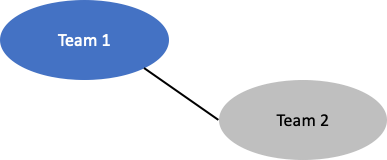
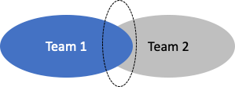
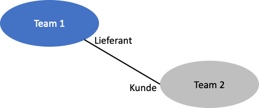

# Strategisches Design
Beim Strategischen Design werden die "groben" Grundlagen geschaffen, für die spätere Detailarbeit. Es sollen die Haupt-Domänen und Sub-Domänen herausgearbeitet werden, die wichtig für das Unternehmen sind und voneinander abgegrenzt werden.

## Strategisches Design Schritt für Schritt
1. Bounded Context herausarbeiten
2. Eine Ubiquitous Language entwerfen
3. Einbinden von Domänen-Experten und Entwicklern
4. Domänen schneiden in Core- und Sub-Domänen
5. Integration und Beziehungen mehrerer Bounded Contexts

## Definitionen

* Bounded Context
  * Soll Domänen-Modelle voneinander abgrenzen
  * Innerhalb eines Bounded Context existiert ein Modell mit einer entwickelten Semantik
  * Domänen-Experten und Entwickler sprechen innerhalb des Context die gleiche Sprache
  
* Ubiquitous Language
  * Jeder im Team versteht den Begriff, präzise und mit allen Bedingungen
  * Begriff und Sprache sind allgegenwärtig und wird auf das Modell übertragen
  * Nicht mehrere Teams sollten an einem Bounded Context arbeiten

* Haupt-Domäne
  * Ist das Herzstück des Unternehmens
  * Soll das Unternehmen einen Wettbewerbsvorteil gegenüber Konkurrenten bieten
  * Fokus auf die Haupt-Domäne legen, man kann nicht in allen Bereichen gut sein
  * Sollte frei von Technologie sein

## Wozu benötigt man einen Bounded Context?
* Worauf legt das Team den Fokus?
* Bündeln der Konzepte, welche im Kern der Unternehmensstrategie liegen
* Weitere Vorteil kleinere Modelle lassen sich einfacher testen
* Immer wieder in Frage stellen, ob es zum Kern passt
* Verhindern von "Big Ball of Mud" und wachsender Komplexität

## Wie entsteht eine Ubiquitous Language?
  * Die Haupt-Domäne sollte nicht nur auf Substantive eingeschränkt werden
  * Konkrete Szenarien erstellen, welche das Domänenmodell beschreiben und wie es funktioniert
  * Bilder, Tabelle oder Diagramme nutzen, diese sollen aber nicht aufhalten

## Context Mapping

### Partnerschaft

* Zwei Teams die an einem Bounded Context arbeiten
* Erfolg oder Misserfolg kann nur gemeinsam erreicht werden
* Synchronisation der beiden Teams intensiv
* Partnerschaft nur so lange beibehalten, wie nötig

### Shared Kernel

* Zwei oder mehrere Teams teilen sich ein gemeinsames Modell
* Einigkeit darüber was im Modell stehen soll
* Ein Team übernimmt die Pflege

### Customer-Supplier

* Upstream (Lieferant) - Downstream (Kunde)
* Abhängigkeit vom Lieferanten
  
### Conformist
* Gleiche Beziehung wie beim Customer-Supplier nur mit dem Unterschied, dass der Lieferant keine Motivation hat, auf Anforderungen einzugehen
* Kunde passt sich an das Modell des Lieferanten an

### Anticorruption Layer
* Eine Art "Übersetzung" wird vom Kunden erstellt
* Überführt/Übersetzt die beiden Modelle

### Open Host Service
* Jeder kann den Bounded Context verwenden und dieser ist relativ leicht integriebar
* Schnittstelle sollte gut dokumentiert sein

### Separate Ways
* Es besteht kein Nutzen darin das andere Modell zu nutzen
* Jedes Team hat seinen eigenen Bounded