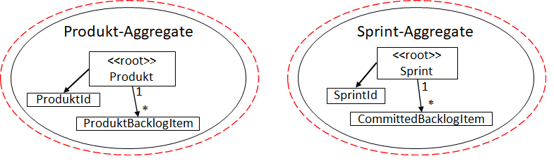

### Entity
 - Jede Entity hat eine eindeutige ID
 - Anhand der ID können Objekte unterschieden werden
 - Zustand kann sich über die Zeit ändern
  
### Value Object
- Ist ein unveränderliches Werte Objekt
- Besitzt keine ID
- Beschreibt häufig eine Entity

### Transaktion
- Steuern die Modifikation von Aggregates
- Stellt sicher das Aggregates immer in einem vollständigen und gütligen Zustand sind

### Wie schneidet man ein Aggregate?
1. Innerhalb von Aggregate-Grenzen gilt es die Fachlichkeit zu schützen  

Am Ende einer bestimmten Transaktion muss die ganz bestimmte Fachlichkeit erfüllt sein.  

2. Die Aggregates sollten möglichst klein sein 

Das Problem daran ist, das die Liste an Sprint- oder ProduktBacklogItem-Objekte sehr groß werden kann. Die Folge der Speicherverbrauch und der Transaktionsumfang können zu groß werden.
Besser wäre es für jedes Objekt ein Aggregate einzuführen, z.B. Sprint-Aggregate welches als Root den Sprint selbst inne hat. Kleinere Aggregates lassen sich auch leichter ändern bzw. testen.  

1. Referenz der Aggregates nur über die Id 

Dies soll dabei helfen, die Aggregates klein zu halten und mehrere Aggregates in der gleichen Transaktion zu verändern. Ein weiterer Vorteil ist, dass einfache und schnelle speichern der Aggregates.  

1. Anwendung von Eventual Consistency
Wie wird der Status in einem anderen Aggregate aktualisiert, bzw. wie bekommt er die Statusänderung in einem anderen Aggregate mit?  

Ein Domänen-Event wird erzeugt und publiziert, in diesem Fall das "BackgroundItemCommitted". Der Empfänger "Sprint Aggregate" startet daraufhin eine Transaktion und aktualisiert den Zustand des Sprints.